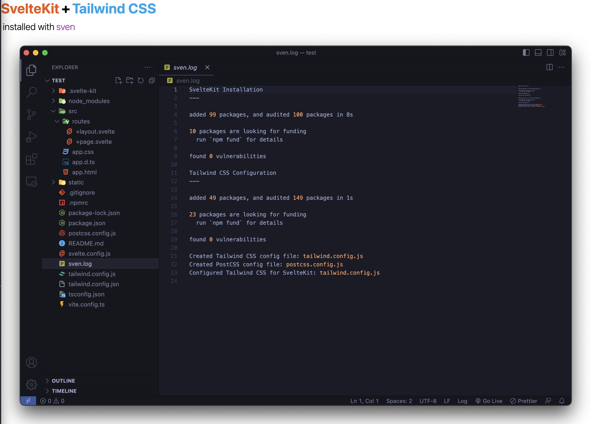

# sven.sh - SvelteKit + Tailwind CSS
This script creates a new svelte project and configures Tailwind CSS



## Usage
```
sven - a quickstart script for SvelteKit + Tailwind CSS
Usage: sven [-t] [-r] project_name
Options:
-t  Configure Tailwind CSS
-r  Open VScode and npm run dev
project_name: A name for your project
```

## Notes
The script calls *npm create svelte@latest* which is an interactive wizard. You have to answer a few questions. 

If the -t switch is passed, it automatically performs the steps located at: https://tailwindcss.com/docs/guides/sveltekit

If the -r switch is passed, it launches VScode, runs the dev server, and opens the browser when complete.

Once complete, there will be a sven.log file in the project directory.

## Why?
I'm learning SvelteKit and found myself repeating these steps far too often 😁